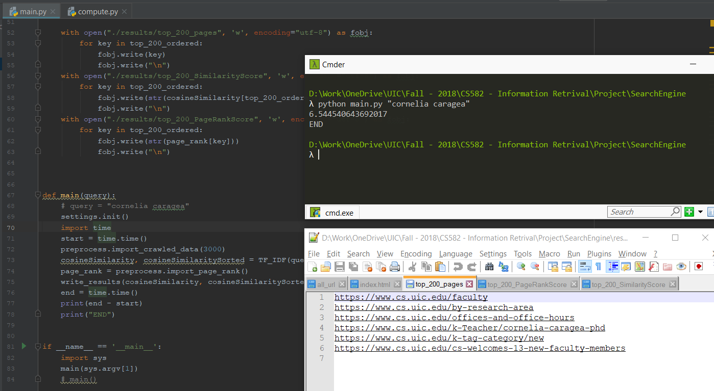

# SearchEngine #

This project was built using Python, HTML, CSS, JavaScript, Flask (with Restful API).

#### Key features implemented #### 
    Note: I have stored data intermittently in local files to speed up the searching process. Also doing everything in one go leads to huge memory dump and is time consuming. Even tried threading but still no significant boost and still doesn’t solve memory issues.

* Crawled around ~3000 websites starting from [ROOT](www.cs.uic.edu)
    * Used Http.Client to check for alive sites to speed up performance.
    * Fetched visible text from sites and stored them in data folder named from 1 to 3000.
    * The stored files are already tokenized, trimmed, stemmed and have their stop words removed.
    * This alone takes up around 1.5 hours to verify alive sites as well as crawling them if they are pointed by the spider
    
* Used TF-IDF to get word weights and used cosine similarity with the query in order to find probable matches.
    * This feature is done offline once the files are crawled and saved in those 3000 files as mentioned above.
* Implemented page rank on entire graph containing over 20000 nodes then sorted them to get the final ranking.
    * This step in my machine is done till 300 node links as this takes a lot of time
* Also done key phrase extraction from the url itself to increase the search probability.
* After the intermittent saving the actual query takes around ~6 seconds to return the result.
    * I am populating the results in the results folder directory via 3 files
        * “top_200_pages: Contains top 200 pages in ranked order
        * “top_200_PageRankScore: Contains top 200 page rank score in ranked order
        * “top_200_similarityScore: Contains top 200 similarity score in ranked order
    * The TOP 200 here is relative to the query: i.e 
        * if the query returns more than 200 pages then it will fetch only the 200 with the highest ranks.
        * If the query returns less than 200 pages then it will fetch only those and not more as there is no match.
* Below is an screenshot of a sample query I did:

 

#### How to run ####

1.	Dataset Available: If you already have the compiled dataset available then you can simply run main.py file with the query parameter. E.g. python main.py “uic”
        
        * This will put your output in the results folder in 3 files as explained above
     
2.	Dataset NOT Available: If you don’t have the compiled dataset available then you must execute few files before running step 1 in the same order mentioned.
        
        * First you need to crawl the web, find links, get textual data, clean it, stem it and tokenize it and store all the info locally. To do this you must run the file “main_webCrawler.py”
        * Second you need to form the web graph for page ranking. Parse all the links incoming and outgoing in for all 3000 links. This results in a sparse graph with more than 16000 connections. To do this you must run the file “main_PR.py”
           
            * This uses python pickle to store graph in a ‘.p’ file and again the ordered page rank also in a ’.p’ file.s
            * 2 pickle files are “page_rank.p” and “web_graph.p”

#### Update/Notes ####
* For your convenience the data set is ported to shared drive: [Dataset](https://1drv.ms/f/s!Ai5HtuHa525IgsQ0qHSukZqla8RgPQ)
* The web version of this is also hosted on [Search](https://smaith2.people.uic.edu/ir_project)
* Currently the results folder contains results for the query “UIC”

